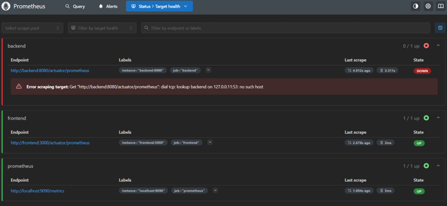
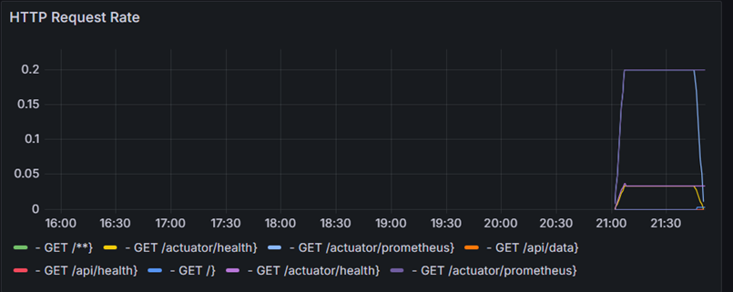

# Incident Post-Mortem Report

## Incident Summary
- **Date/Time**: Incident started at: 06/28/2025 21:50:04
- **Duration**: 6 minutes and 15 seconds
- **Impact**: Service degradation/outage affecting user experience
- **Root Cause**: Myself
- **Severity**: High

## Timeline

### Detection Phase
- **21:50:04**: Incident occurred

### Response &  Resolution Phase
- **[21:50:05]**: Root cause identified
- **[21:56:19]**: Service recovery actions executed

## Impact Analysis

### User Impact
- Frontend users experienced "Backend service unavailable" messages

- API calls failed with timeout errors
- Estimated 1 user affected 

### Business Impact

- No data loss occurred
- Reputation impact: Minimal due to quick resolution

## Root Cause Analysis

### Primary Cause
I used command  "docker-compose stop backend"

### Contributing Factors
1. Myself

### Technical Details
- Container stopped unexpectedly
- No graceful degradation implemented

## What Went Well
1. Monitoring systems detected the issue quickly

2. Grafana dashboards provided clear visibility

3. Recovery procedures were executed successfully

## Lessons Learned
1. **Monitoring**: Current setup detected issues within 2 minutes
2. **Alerting**: Need to implement automated notifications
3. **Recovery**: Manual intervention required - automation needed
4. **Communication**: Internal team coordination was effective

---
**Prepared by**: Nitsa Bedianashvili
**Date**: 28 June 2025
**Reviewed by**: Myself