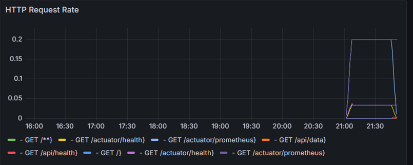
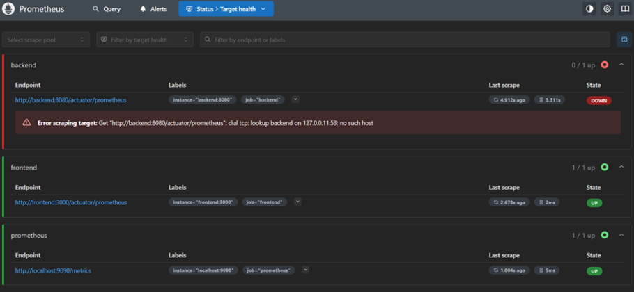
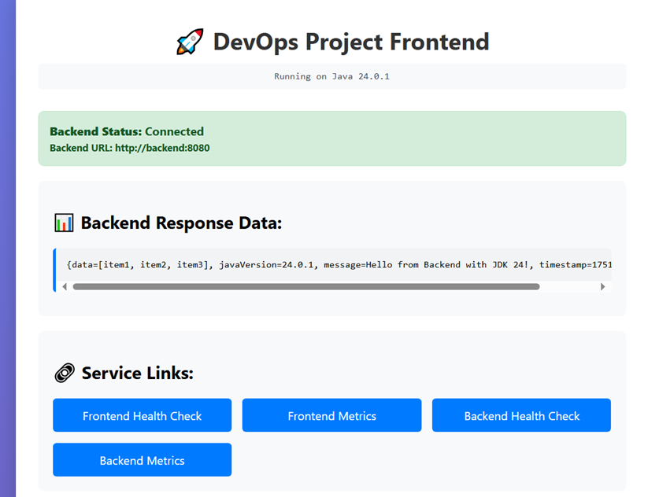
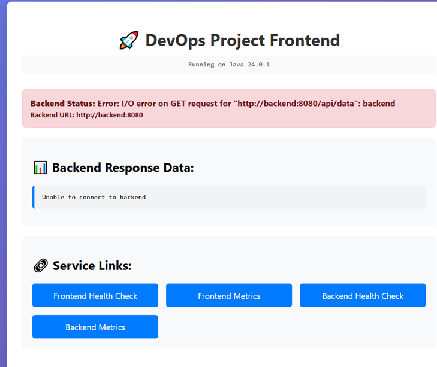

# DevOps Final Project

A comprehensive DevOps implementation featuring a microservices architecture with monitoring, security scanning, and incident management capabilities.

## 🏗️ Architecture Overview

This project demonstrates a complete DevOps pipeline with the following components:

- **Backend Service**: Spring Boot 3.5.3 application with Java 24
- **Frontend Service**: Spring Boot application with Thymeleaf templates
- **Monitoring Stack**: Prometheus + Grafana for metrics collection and visualization
- **Security**: Automated vulnerability scanning with Trivy
- **Containerization**: Docker Compose for orchestration
- **Incident Management**: Post-mortem documentation and monitoring

## 🚀 Quick Start

### Prerequisites

- Docker and Docker Compose
- Java 24 JDK
- Maven 3.8+
- Trivy (for security scanning)

### Setup Instructions

1. **Clone the repository**
   ```bash
   git clone <repository-url>
   cd DevOpsFinal/DevOps
   ```

2. **Configure environment variables**
   ```bash
   # Copy and modify the environment file
   cp .env.example .env
   # Edit .env with your specific values
   ```

3. **Build and start services**
   ```bash
   # Build all services
   docker-compose build
   
   # Start the entire stack
   docker-compose up -d
   ```

4. **Verify deployment**
   ```bash
   # Check service status
   docker-compose ps
   
   # View logs
   docker-compose logs -f
   ```

### Service Endpoints

| Service | URL | Description |
|---------|-----|-------------|
| Frontend | http://localhost:3000 | Web application interface |
| Backend API | http://localhost:8080 | REST API endpoints |
| Grafana | http://localhost:3001 | Monitoring dashboard |
| Prometheus | http://localhost:9090 | Metrics collection |

**Default Credentials:**
- Grafana: `admin` / `admin123`

## 📊 Services Overview

### Backend Service
- **Technology**: Spring Boot 3.5.3 with Java 24
- **Port**: 8080
- **Features**:
  - RESTful API endpoints
  - Spring Boot Actuator for health checks
  - Prometheus metrics integration
  - Health check endpoint: `/actuator/health`
  - Metrics endpoint: `/actuator/prometheus`

### Frontend Service
- **Technology**: Spring Boot with Thymeleaf templates
- **Port**: 3000
- **Features**:
  - Web interface for user interaction
  - Integration with backend API
  - Real-time status monitoring
  - Responsive design

### Monitoring Stack

#### Prometheus
- **Configuration**: `monitoring/prometheus/prometheus.yml`
- **Scrape Interval**: 15s (global), 5s (application services)
- **Targets**:
  - Backend service metrics
  - Frontend service metrics
  - Self-monitoring

#### Grafana
- **Dashboard**: `monitoring/grafana/dashboards/app-dashboard.json`
- **Features**:
  - Container CPU usage monitoring
  - Memory utilization tracking
  - Service health status
  - Custom alerting rules

## 🔒 Security Implementation

### Automated Security Scanning

The project includes automated security scanning using Trivy:

```bash
# Run security scans
./security-scan.bat
```

**Scanned Components:**
- Backend Docker image
- Frontend Docker image
- Prometheus image
- Grafana image

**Scan Results:**
- Reports saved to `security-reports/` directory
- Critical and high vulnerability alerts
- Automated summary generation

### Security Features

1. **Container Security**
   - Base image vulnerability scanning
   - Regular security updates
   - Minimal attack surface

2. **Network Security**
   - Isolated Docker networks
   - Service-to-service communication only
   - No direct external access to internal services

3. **Environment Security**
   - Environment variables for sensitive data
   - Secure password management
   - No hardcoded credentials

## 📈 Monitoring and Observability

### Metrics Collection

The application exposes comprehensive metrics through Spring Boot Actuator:

- **Health Checks**: Service availability monitoring
- **Prometheus Metrics**: Custom application metrics
- **Container Metrics**: CPU, memory, and network usage

### Dashboard Screenshots

The monitoring implementation includes several key dashboards:

1. **Service Health Dashboard** - Real-time service status monitoring
   

2. **Performance Metrics** - CPU and memory utilization tracking
   

3. **Incident Response** - Monitoring during service outages
   

4. **Error Monitoring** - Service degradation detection
   

### Alerting and Incident Management

The project includes a comprehensive incident management system:

- **Real-time Monitoring**: Automatic detection of service issues
- **Incident Documentation**: Post-mortem reports for all incidents
- **Recovery Procedures**: Automated and manual recovery processes

## 🚨 Incident Management

### Recent Incident (June 28, 2025)

**Incident Summary:**
- **Duration**: 6 minutes 15 seconds
- **Impact**: Service degradation affecting user experience
- **Root Cause**: Manual container stop operation
- **Resolution**: Quick recovery with monitoring validation

For detailed incident analysis, see: [Incident Post-Mortem](DevOps/incident-postmortem.md)

## 🛠️ Development

### Building Services

```bash
# Build backend
cd backend
mvn clean package

# Build frontend
cd frontend
mvn clean package
```

### Running Tests

```bash
# Backend tests
cd backend
mvn test

# Frontend tests
cd frontend
mvn test
```

### Docker Commands

```bash
# Build specific service
docker-compose build backend

# View logs
docker-compose logs backend

# Scale services
docker-compose up --scale backend=2

# Stop all services
docker-compose down
```

## 📁 Project Structure

```
DevOpsFinal/
├── DevOps/
│   ├── backend/                 # Backend Spring Boot service
│   ├── frontend/               # Frontend Spring Boot service
│   ├── monitoring/             # Monitoring configuration
│   │   ├── grafana/           # Grafana dashboards
│   │   └── prometheus/        # Prometheus configuration
│   ├── docker-compose.yml     # Service orchestration
│   ├── security-scan.bat      # Security scanning script
│   ├── incident-postmortem.md # Incident documentation
│   └── .env                   # Environment configuration
└── README.md                  # This file
```

## 🔧 Configuration

### Environment Variables

Key configuration options in `.env`:

```bash
# Database settings
DB_USER=devops_user
DB_PASSWORD=secure_password_123

# Service URLs
BACKEND_URL=http://backend:8080
FRONTEND_URL=http://frontend:3000

# Monitoring ports
PROMETHEUS_PORT=9090
GRAFANA_PORT=3001

# Java optimization
JAVA_OPTS=-Xmx512m -Xms256m
```

### Health Checks

All services include health check endpoints:

- **Backend**: `http://localhost:8080/actuator/health`
- **Frontend**: `http://localhost:3000/actuator/health`


## 👥 Team

- **Developer**: Nitsa Bedianashvili
- **Project**: DevOps Final Project
- **Date**: June 2025

---

**Note**: This project demonstrates comprehensive DevOps practices including CI/CD, monitoring, security, and incident management. All services are containerized and can be easily deployed to any environment supporting Docker.
